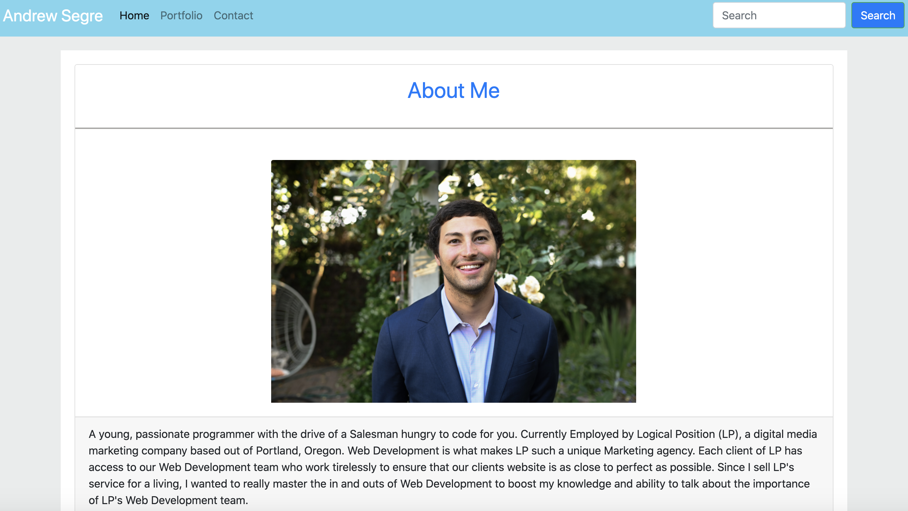
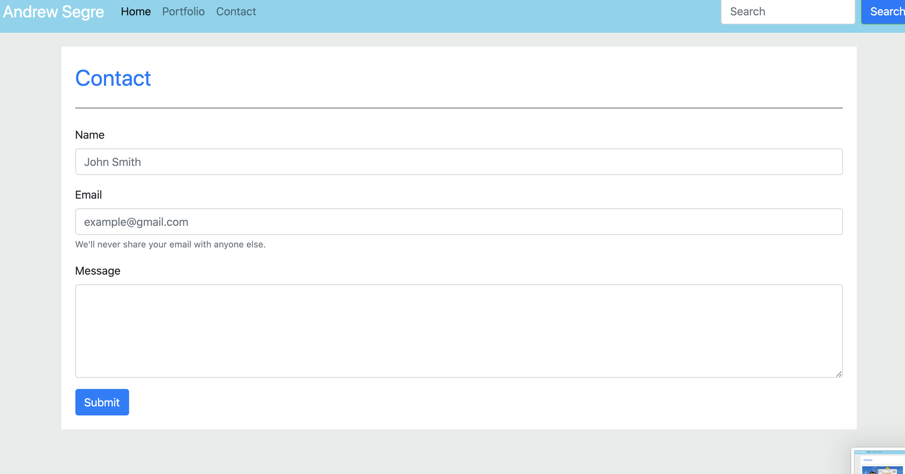
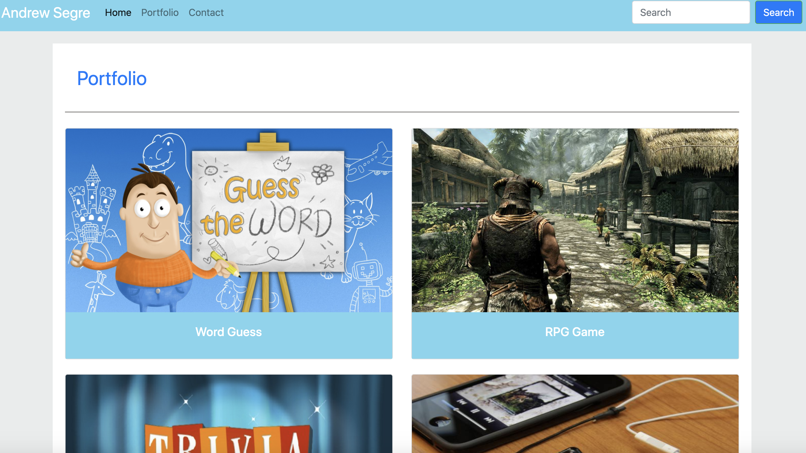

# Unit 02 CSS and Bootstrap Homework: Responsive Portfolio

README:

updated styling using bootstrap 

New Projects comming soon to add to the portfolio.html

My Portfolio page put cards inside specific rows and columns, while the about me page is one large card in the middle of the page. 

The Contact page uses a Form to prompt user for specific info.

## Technologies

   html
   css
   js
   Bootstrap

## Deployed:

Website:

https://asegre18.github.io/updated-portfolio/

Github Repo:

https://github.com/asegre18/updated-portfolio/

## Screenshots

